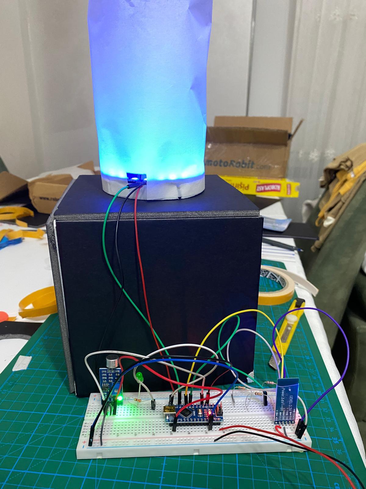
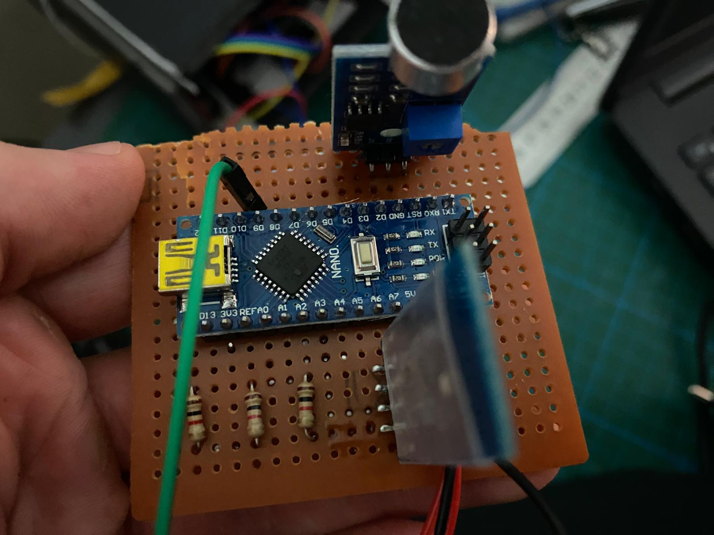

# Smart RGB Lamp with Bluetooth and Sound Control

This repository contains my smart lamp project developed using Arduino Nano, Bluetooth communication, RGB LED control, and a microphone sound sensor module.

The project was designed as an embedded systems application that allows an RGB lamp to be controlled wirelessly via Bluetooth and also react to sound input detected by a microphone module.

---

## Project Overview

The main purpose of this project was to build a smart lighting system by combining hardware and software components.

The system uses an Arduino Nano as the main controller. RGB LEDs are used as the lighting output, while a Bluetooth module enables wireless control. A microphone sensor module is used to detect sound levels and create sound-reactive lighting behavior.

---

## Features

* Bluetooth-based wireless control
* RGB LED color control
* Sound-reactive lighting using microphone sensor module
* Arduino Nano based embedded system
* Breadboard prototype and custom circuit board implementation
* Basic user-interactive smart lamp structure

---

## Working Principle

The Arduino Nano controls the RGB LED outputs according to the received input signals.

The Bluetooth module allows the lamp to receive wireless commands from a phone or another Bluetooth-enabled device. These commands can be used to change the lighting mode or RGB color behavior.

The microphone sensor module detects sound intensity from the environment. According to the detected sound level, the Arduino changes the RGB LED output, creating a sound-reactive lamp effect.

---

## Prototype

The first version of the project was tested on a breadboard with Arduino Nano, RGB LEDs, Bluetooth module, and microphone sensor module.

---

## Circuit Board

After testing the circuit, the components were assembled on a perforated prototype board to create a more stable hardware setup.

---

## Demo Video

A demo video of the smart lamp can be found here:

[Watch Demo Video](videos/demo.mp4)

---

## Main Components

* Arduino Nano
* RGB LEDs / LED strip
* Bluetooth module
* Microphone sound sensor module
* Resistors
* Jumper wires
* Breadboard
* Perforated prototype board
* External lamp body / diffuser

---

## What I Learned

Through this project, I gained practical experience in:

* Arduino-based embedded system development
* RGB LED control
* Bluetooth communication
* Sound sensor integration
* Analog/digital sensor reading
* Breadboard prototyping
* Moving a prototype circuit to a perforated board
* Building an interactive lighting system

---

## Tools and Technologies

* Arduino Nano
* Arduino IDE
* C/C++
* Bluetooth communication
* Microphone sensor module
* RGB LED control
* Embedded systems prototyping

---

## Author

**Talha Üzümcü**
Electrical and Electronics Engineer
GitHub: [talhazmc](https://github.com/talhazmc)
